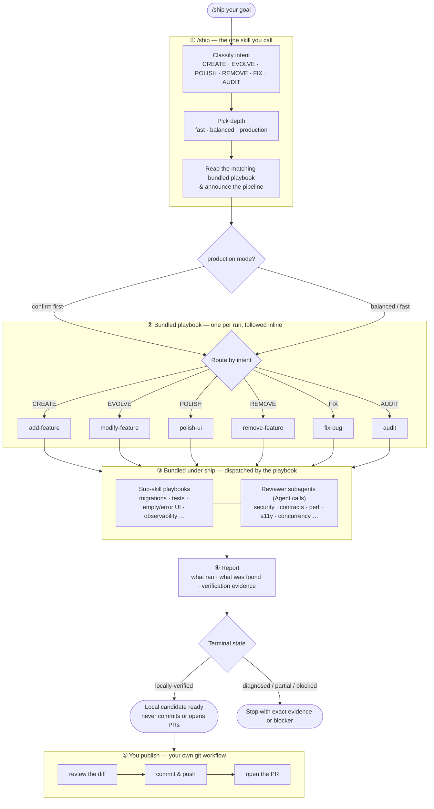

# AgentSystem

**Website:** [agentsystem.dev](https://agentsystem.dev)

AgentSystem is a skill pack for AI coding agents. It exists for one reason: **you describe a goal, the agent picks the right engineering workflow and depth, runs the checks that matter, and stops when the code is ready** — from a single skill, so you never memorize a catalog of commands or guess whether a change needs a quick tweak or a production gate.

You should almost never call individual skills yourself. Use **`/ship`**.

---

## Does it actually work? We benchmarked it.

Same 5 feature briefs, same production codebase, same model (Opus 4.8, xhigh) — three ways: a plain prompt, a *"think like a senior engineer"* prompt, and `/ship`. All 15 implementations blind-graded from raw diffs by a stronger model on a fixed rubric.

| | Plain prompt | "Senior engineer" prompt | **/ship** |
|---|---|---|---|
| Avg quality /50 | 43.2 | 41.0 | **47.0** |
| Features won | 0/5 | 0/5 | **5/5** |
| Crashes shipped | 0 | 1 branch (2 crash classes) | **0** |
| Invariant tests written | 1/5 branches | 0/5 | **5/5** |

**+9% vs plain prompting, +15% vs persona prompting, zero crashes, and a HIGH-severity authz hole caught by a review gate before it shipped.** The persona prefix actually *underperformed* the plain prompt. Cost of the pipeline: ~81% more tokens.

Every prompt, PR, score, cost, and — importantly — every limitation (sample size, LLM judge, conflict of interest) is documented so you can decide for yourself: **[read the full benchmark →](docs/experiments/2026-07-three-arm-benchmark.md)**

---

## Use it

```
/ship add stripe webhook handler
/ship the login button doesn't redirect
/ship delete the old beta-flags page
```

Or describe your goal normally and end with **"use ship skill"** (or attach the ship skill in Cursor).

That's the whole interface. `/ship` classifies what you want, picks how thorough to be, runs the right pipeline, and reports what it did. It **never** commits, pushes, or opens PRs — you choose that after reviewing the diff.

### Examples

| You say | `/ship` decides |
|---|---|
| "add a settings page" | CREATE → balanced depth |
| "make the navbar green" | EVOLVE → fast (cosmetic) |
| "add OAuth" | CREATE → production (auth) |
| "polish the dashboard" | POLISH → UX checklist pass |
| "audit the codebase for rot" | AUDIT → full sweep |

Optional overrides when you care: `mode=fast`, `mode=balanced`, `mode=production`, or `skip=` / `include=` phase hints.

### After `/ship` finishes

`/ship` hands you a locally-verified candidate and stops — it never commits, pushes, or opens a PR. Publishing is your own git workflow: review the diff, then commit, push, and open the PR yourself. That last step is deliberately yours, not the engine's.

---

## How it works

`/ship` is the only skill in your tool picker. Everything below — the delivery playbooks and the reviewer subagents — is bundled inside it and orchestrated for you.



**In plain terms:**

1. **Classify intent** — CREATE, EVOLVE, POLISH, REMOVE, FIX, or AUDIT — from how you phrase the request.
2. **Pick depth** — `fast` (tiny/cosmetic), `balanced` (default), or `production` (auth, payments, migrations, webhooks, jobs, multi-subsystem work).
3. **Read the matching bundled playbook** and follow it inline — one per run — announcing the pipeline before running.
4. **Challenge risky plans** — production/high-risk multi-subsystem plans get an independent read-only red-team before approval.
5. **Dispatch bundled subagents** — the playbook fans out to sub-skill playbooks and read-only reviewer subagents (general-purpose Agent calls) only when gates fire — migrations, tests, security/perf/contract audits, and more.
6. **Reconcile and verify** — parallel findings are deduplicated into one disposition ledger; complex production changes get a fresh combined-tree verifier after every mutation.
7. **Report an honest terminal state** — `diagnosed`, `locally-verified`, `partial`, or `blocked`; only a locally-verified candidate is handed back for you to publish.

High-risk work (`production` mode) asks you to confirm before executing. `balanced` announces the plan and proceeds. `fast` just goes.

---

## Install

### Claude Code (plugin marketplace)

```
/plugin marketplace add https://github.com/AgentSystemLabs/core
/plugin install agentsystem-core@agentsystem
```

Update: `/plugin marketplace update agentsystem` · Uninstall: `/plugin uninstall agentsystem-core@agentsystem`

### Any agent that reads `SKILL.md` (Cursor, Codex, OpenCode, custom)

```bash
npx @agentsystemlabs/core init                  # → ./.claude/skills/ship/
npx @agentsystemlabs/core init --harness cursor # → ./.cursor/skills/ship/
npx @agentsystemlabs/core init --harness codex  # → ./.codex/skills/ship/
npx @agentsystemlabs/core init --global         # user-level install
npx @agentsystemlabs/core list                  # what's available
```

Harnesses: `claude`, `codex`, `cursor`, `opencode`. Installs the single `ship` skill with its bundled tree — the delivery playbooks and reviewer subagents come along inside it. Pass `--force` to overwrite existing files.

---

## Under the hood (you don't need to call these)

Everything below is **bundled inside the `ship` skill** — nothing here registers separately, and nothing here shows up in your tool picker. Playbooks live at `skills/ship/playbooks/<name>/PLAYBOOK.md`; reviewer subagents at `skills/ship/subagents/<name>.md`. Listed so you know what you're getting, not so you memorize commands — there's only one, `/ship`.

### Delivery playbooks (`/ship` reads and follows one per run)

| Intent | Playbook | What it does |
|---|---|---|
| CREATE | `add-feature` | Clarify → explore → design → implement → verify → gated reviews → tests |
| EVOLVE | `modify-feature` | Extend existing behavior; audits shifted contracts |
| POLISH | `polish-ui` | UX checklist on existing UI — no behavior change |
| REMOVE | `remove-feature` | Safe deletion with persisted-data awareness |
| FIX | `fix-bug` | Runtime contract trace before hypotheses; regression test when fixed |
| AUDIT | `audit` | Whole-codebase tech-debt sweep |

### Sub-skill playbooks (dispatched when gates fire)

Delivery helpers: `add-migration`, `write-tests`, `add-e2e-test`, `add-regression-test`, `add-empty-error-states`, `add-observability`, `simplify`, `propagate-ui-pattern`, `realign`, `harden-types`

Scoped audits (diff or whole-app, depending on context): `audit-authz`, `audit-a11y`

### Reviewer subagents (read-only, never edit files)

Dispatched by the playbook as general-purpose Agent calls that read `skills/ship/subagents/<name>.md` as their prompt — never as separate registered agents.

`reviewer-code`, `reviewer-authz`, `reviewer-security-regression`, `reviewer-data-integrity`, `reviewer-contracts`, `reviewer-boundary-validation`, `reviewer-concurrency`, `reviewer-error-boundaries`, `reviewer-loading-states`, `reviewer-accessibility-regression`, `reviewer-client-bundle`, `reviewer-observability-coverage`, `reviewer-perf`, `reviewer-dependencies`, `reviewer-test-quality`, plus mappers like `crud-surface-mapper`, `ui-pattern-inspector`, `utility-finder`, and `runtime-contract-tracer`.

Production reliability roles are also read-only:

- `plan-red-team` challenges risky plans against real code before approval.
- `findings-reconciler` merges parallel reports, resolves conflicts, records coverage, and tracks disposition.
- `integration-verifier` attacks combined-tree seams and reruns final gates after all mutating post-steps.

These roles are adaptive, not a fixed fleet tax. Small and ordinary changes continue through the existing fast/balanced paths.

**There's nothing here to `@` or slash-command.** They exist so `/ship` can fan out parallel audits and return severity-ranked findings with file:line refs.

### There is only `/ship`

No other slash commands to learn — `ship` is the single registered skill. Publishing (commit, push, PR, release) is your own git workflow, not a bundled command. For feature work, bugs, polish, removal, and codebase audits: **use `/ship`**.

---

## Deeper docs

- [`docs/ship-diagrams.md`](docs/ship-diagrams.md) — Mermaid diagrams of the full routing and gate fan-out (for teaching / contributors).

---

## License

See [`LICENSE`](LICENSE).
